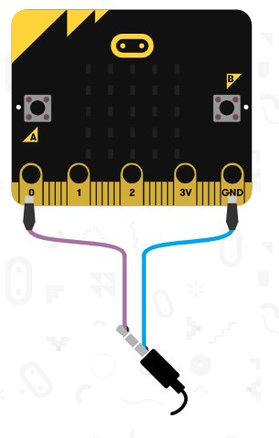
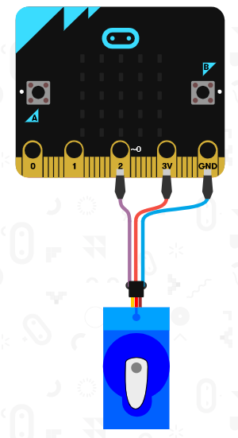

# Microbit Playground
Play around with the basics of Microbit

## Table of contents

- [Microbit Playground](#Microbit-Playground)
  - [Table of contents](#Table-of-contents)
  - [Bill of materials](#Bill-of-materials)
  - [Software](#Software)
  - [Game 1](#Game-1)
  - [Game 2](#Game-2)
  - [Game 3](#Game-3)
  - [Future improvements](#Future-improvements)
  - [Further reading](#Further-reading)

## Bill of materials

| Qty | Code                                     | Description              |
| --- | ---------------------------------------- | ------------------------ |
| 1   | [XC4320](https://jaycar.com.au/p/XC4320) | BBC: microbit            |
| 1   | [WC6032](https://jaycar.com.au/p/WC6032) | Aligator to jumper leads |
| 1   | [WC6010](https://jaycar.com.au/p/WC6010) | Aligator leads           |
| 1   | [PB8819](https://jaycar.com.au/p/PB8819) | Breadboard with power    |
| 1   | [YM2758](https://jaycar.com.au/p/YM2758) | 9G servo                 |
| 1   | [AS3185](https://jaycar.com.au/p/AS3185) | Speaker box              |
| 1   | [RP7610](https://jaycar.com.au/p/RP7610) | 10k Pot (Log)            |


## Software

The online microbit python editor is our editor of choice. Go to <https://python.microbit.org/v/1.1> to open up the editor then copy and paste the python code from this project's resources. 

You should be able to download the hex file and copy that onto your microbit drive. For any changes you do to the code you will have to download the hex file and copy it over again.

## Game 1

Game 1 is a type of getting game where you must keep in beat of the music; While playing between each beat of music, we'll point left and right to signify the A and B buttons; then when there is a break in the music, the player must then press the button that was **supposed** to be played.

We start with some melodies, stored in a list of lists:
```python 

tunes = [
    ["C4:4", 'C', 'D', 'D', 'E', 'E', 'x', 'G', 'G', 'E', 'E', 'A', 'A', 'x'],
    ["C4:4", "D", "E", "C", "C", "D", "E", 'x', "C", "E", "F", "G:8", "E:4", "F", 'x', "G:8"],
    ["C2:2"] + [letter for letter in "ABCDExFGFEDCBABxCDEFxGFEDCxBA"]
]
```

- You can read more about melodies here: <https://microbit-micropython.readthedocs.io/en/latest/tutorials/music.html>

Connect the speaker between pin 0 and ground using some aligator clips.



```python
def game1():
    # Guess the tone
    lives = 3
    for level, tune in enumerate(tunes):
        for pos, tone in enumerate(tune):

            if pos % 2 == 0:
                display.show(Image.ARROW_W)
            else:
                display.show(Image.ARROW_E)

            if tone != 'x':
                music.play([tone])
            else:
                correctGuess = game1Guess(level, pos)

                if correctGuess:
                    music.play(music.POWER_UP)
                    display.show(Image.HAPPY)
                else:
                    lives -= 1
                    music.play(music.POWER_DOWN)
                    display.show(Image.SAD)

                sleep(1000)

            if lives == 0:
                gameOver = True
                return
    # success! onwards to game 2
    game2()
```

## Game 2

Now to use a potentiometer, you can use `pin1.read_analog()` to read a value from the potentiometer.

Connect the center pin of the potentimeter to pin 1, the left pin to 3v, and the right pin to ground.

In this game, you are trying to find the point via sound; keep turning the potentiometer and if the sound gets faster, you're on the right track.

```python
def game2():

    lives = 3
    for level in range(5):

        point = random.randint(0, 1023)

        reading = 0
        timing = time.ticks_ms()

        while reading != point:
            reading = pin1.read_analog()

            difference = abs(point - reading)

            # play tone indicating; faster tone => closer
            music.pitch(440, difference)

            # if time is too large; then we lose a life.
            if time.ticks_diff(time.ticks_ms(), timing) > ((5-level) * 1000):
                lives -= 1
                music.play(music.POWER_DOWN)
                display.show(Image.SAD)
                sleep(1000)
                break

        if lives == 0:
            gameOver = True
            return

    game3()
```

## Game 3

Now we will use the accelometer and Servo for the next game; connect the Servo to pin 2.


Here we will read the on-board accelometer values then show that effect on the servo; The aim is to get the servo to 90 degrees for 3 seconds.

There's actually no game-over in this game.

```python
def game3():
    # Balance the skateboard
    #  
    ship = Servo(pin2)  # what pin is the servo on?

    timer = time.ticks_ms()

    while True:

        point = random.randint(1023)
        value = accelerometer.get_x()

        difference = point - value

        if difference > 20:
            display.show("R")
        elif difference < -20:
            display.show("L")
        else:
            display.show("-")

        ship.write_angle(90 + (difference/1023)*90)

        if difference < 20:
            #must hold it for more than 3 seconds
            if time.ticks_ms() - timer > 3000:
                #success! return
                return

        else:
            timer = time.ticks_ms()
```

## Future improvements

- Use our [XC4332](https://jaycar.com.au/p/XC4332), [XC4330](https://jaycar.com.au/p/XC4330) or [XC4336](https://jaycar.com.au/p/XC4336) to make your game a lot more portable.

## Further reading 

- Microbit Micropython documentation <https://microbit-micropython.readthedocs.io/en/latest/microbit_micropython_api.html>
- https://microbit.org/guide/quick/
- https://tech.microbit.org/hardware/